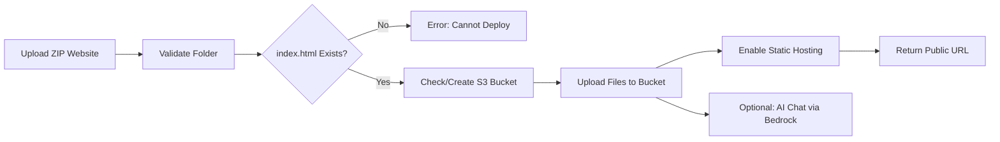

# AWS S3 Hosting Agent with Streamlit

  

An **autonomous Streamlit app** to deploy static websites to **AWS S3** using **AWS Bedrock** for reasoning and planning. Upload your website as a ZIP file, and the agent will handle bucket creation, file uploads, static hosting, and URL verification automatically.

---

## 🚀 Features

- Upload a ZIP file containing your static website.  
- Validates website structure: `index.html` required, `error.html` optional.  
- Suggests and creates unique S3 bucket names.  
- Uploads files **without ACLs**; uses **bucket policies** for secure public access.  
- Enables static website hosting and returns a **public URL**.  
- Optional **chat interface** powered by AWS Bedrock LLM for deployment instructions and assistance.  

---

## 📸 Demo Screenshot

  
*Replace with your own screenshot of the deployed app.*

---

## ⚙️ Installation / Setup

### 1. Clone the repository
```bash
git clone https://github.com/your-username/aws-s3-hosting-agent.git
cd aws-s3-hosting-agent
```

### 2. Install dependencies
```bash
pip install -r requirements.txt
```

### 3. Streamlit Cloud Deployment
1. Push the repository to GitHub.  
2. Go to [Streamlit Community Cloud](https://share.streamlit.io/) → **New App** → Select your repo.  
3. Add **Secrets** (under Settings → Secrets):
```
AWS_ACCESS_KEY_ID = "YOUR_AWS_ACCESS_KEY"
AWS_SECRET_ACCESS_KEY = "YOUR_AWS_SECRET_KEY"
AWS_DEFAULT_REGION = "ap-south-1"
BEDROCK_MODEL_ID = "anthropic.claude-3-5-sonnet-20240620-v1:0"
```
4. Deploy! Streamlit Cloud automatically installs dependencies from `requirements.txt`.

### 4. Running Locally (Optional)
```bash
streamlit run app_simple.py
```
> For local testing, create a `.env` file with the same credentials (optional). Ensure `.env` is in `.gitignore`.

---

## 📝 Usage

1. **Upload your website ZIP file**.  
2. Type a **deployment command** in the chat box, e.g.:
```
Host my website
Deploy to S3
Upload and launch website
```

3. The agent will:  
   - Validate website files  
   - Check bucket availability  
   - Create bucket and configure public access  
   - Upload files  
   - Enable static hosting  
   - Return your **public URL**  

4. Optional: Ask questions using the AI-powered chat interface.

---

## 📂 Project Structure

```
aws-s3-hosting-agent/
│
├─ agent.py           # Core AWS & deployment logic
├─ app_simple.py      # Streamlit frontend
├─ requirements.txt   # Python dependencies
└─ README.md          # Project documentation
```

---

## 🔒 Security Notes

- **Never commit AWS credentials** to GitHub.  
- Use **Streamlit Secrets** for cloud deployment.  
- `.env` is only for local testing and should remain in `.gitignore`.

---

## 🌐 Supported AWS Services

- **S3** – Static website hosting  
- **Bedrock** – Optional AI reasoning & planning  

---

## 📊 Workflow Diagram



---

## 📦 Dependencies

- Python 3.10+  
- Streamlit  
- Boto3 + Botocore (AWS SDK)  
- Requests  
- Python-dotenv (for local `.env`)  

---

## 📜 License

MIT License – free to use and modify.

---

## ✉️ Contact / Support

For questions or issues, contact: **your-email@example.com**

